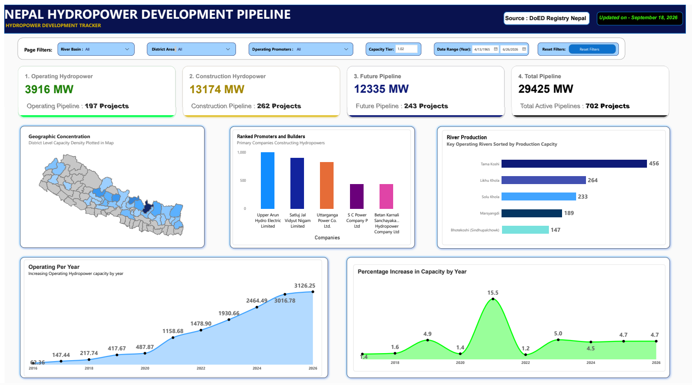
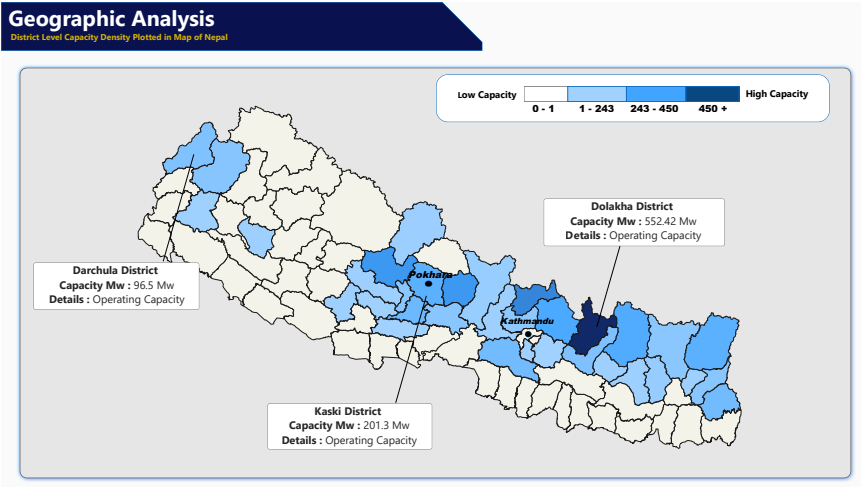

#  Nepal Hydropower Development Pipeline Analysis

### Analyzing Nepal's Current Hydropower Capacity, Development Pipeline, Geographic Concentration, and Historical Growth

##  Project Overview
Nepal has significant hydropower potential, with projects progressing through multiple stages of development. This project analyzes hydropower projects across **operating, construction, and survey stages** to understand the country's current generation capacity and future development pipeline.

The project uses data from the **Department of Electricity Development (DOED), Nepal**, and combines **Python, PostgreSQL/SQL, Excel, and Power BI** to perform data cleaning, exploratory analysis, geographic analysis, and interactive visualization.

The analysis covers **702 hydropower projects representing 29,425 MW of capacity** across the three development stages.

### Development Pipeline

| Development Stage  | Projects |      Capacity |
| ------------------ | -------: | ------------: |
| Operating          |      197 |      3,916 MW |
| Under Construction |      262 |     13,174 MW |
| Survey             |      243 |     12,335 MW |
| **Total**          |  **702** | **29,425 MW** |

---
#  Problem Statement

Nepal's hydropower sector contains projects at very different stages of development. Looking only at currently operating projects does not provide a complete picture of the country's potential future capacity.

This project therefore analyzes:

* Current operating hydropower capacity
* Projects under construction
* Survey-stage projects
* Geographic concentration of hydropower development
* Major rivers and their associated capacity
* Promoters developing hydropower projects
* Historical changes in hydropower capacity
* The overall scale of Nepal's future hydropower pipeline

The goal is to transform raw hydropower licensing data into **actionable insights through data analysis and visualization**.

---

#  Questions

The analysis attempts to answer the following questions:

### Capacity & Development

1. How many hydropower projects are currently operating?
2. How much capacity is currently operating?
3. How much capacity is under construction?
4. How much capacity is currently in the survey stage?
5. How large is Nepal's overall hydropower development pipeline?

### Geographic Analysis

6. Which districts have the highest operating hydropower capacity?
7. Which districts contain the largest amount of capacity under construction?
8. Where is future hydropower capacity geographically concentrated?
9. Which areas show the highest concentration of hydropower development?

### River Analysis

10. Which rivers contribute the most operating hydropower capacity?
11. Which rivers have the largest amount of capacity under construction?

### Promoter Analysis

12. Which promoters have the largest hydropower capacity under development?
13. Which promoters have the largest number of projects?

### Historical Analysis

14. How has Nepal's hydropower capacity changed over time?
15. What is the historical annual growth rate of hydropower capacity?

---

#  Tools & Technologies

### Python / Pandas

### PostgreSQL / SQL

### Power BI


---

#  Dataset

**Source:** Department of Electricity Development (DOED), Nepal

The project contains data relating to hydropower projects in different development stages:

| Dataset             | Description                                  |
| ------------------- | -------------------------------------------- |
| Operating           | Hydropower projects currently in operation   |
| Construction        | Projects with construction licenses          |
| Survey              | Projects with survey licenses                |

The SQL analysis treats these stages as separate datasets and calculates project counts and total capacity independently for each stage. 

---

#  Dashboard

The Power BI dashboard is divided into several analytical sections.

## 1. Overview


The overview provides a high-level picture of Nepal's hydropower development pipeline.

Key metrics include:

* Total number of projects
* Total hydropower capacity
* Operating capacity
* Construction capacity
* Survey-stage capacity
* Distribution of projects across development stages

This section provides the starting point for understanding the scale of Nepal's hydropower sector.




---

#  2. River Analysis

The river analysis examines hydropower capacity across major rivers and river systems.

### Operating Capacity

The analysis identifies the rivers contributing the largest amount of currently operating capacity.

* **Tama Koshi:** ~456 MW
* **Likhu Khola:** ~264 MW
* **Solu Khola:** ~233 MW

### Construction Capacity

The construction analysis highlights rivers with significant future generation capacity currently being developed.

* **Arun River:** ~1,963 MW
* **Budi Gandaki:** ~903 MW
* **Tila:** ~860 MW

This analysis helps identify the river systems that are currently contributing significantly to Nepal's hydropower development pipeline.

---

#  3. Geographic Analysis

The geographic analysis maps hydropower capacity at the **district level** to identify areas with high concentrations of development.




The Power BI map uses a capacity-density approach, with districts shaded according to their hydropower capacity.

The analysis highlights differences between districts and allows operating capacity to be examined geographically.

### Selected District Findings

* **Dolakha:** approximately **552 MW** operating capacity
* **Kaski:** approximately **201.3 MW** operating capacity
* **Darchula:** approximately **96.5 MW** operating capacity

The map also demonstrates that hydropower development is concentrated across several **hill and Himalayan districts**.

The underlying SQL analysis calculates both project counts and total capacity by district for operating, construction, and survey-stage projects. 

---
#  4. Promoter Analysis

The promoter analysis examines which companies and organizations are responsible for developing hydropower projects.

The analysis compares:

* Number of projects per promoter
* Total capacity per promoter
* Operating projects
* Construction projects
* Survey-stage projects

This provides an additional perspective on how hydropower development is distributed among project developers.

The SQL analysis groups projects by `promoter_new` and calculates both project count and total capacity for each development stage. 

---

#  5. Historical Growth Analysis

The historical analysis examines how Nepal's hydropower capacity has changed over time.

The analysis uses commercial operation dates from operating projects to calculate yearly project counts and total capacity. 

### Historical Capacity

Based on the figures used in the dashboard:

**2016:** 62.36 MW
**2025:** 3,016.78 MW

This represents substantial growth in operating hydropower capacity over the analyzed period.

> **Note:** The 2025 figure (3,016.78 MW) reflects capacity recorded up to the available data cutoff, as 2025 data is not yet complete.

### CAGR

The compound annual growth rate can be calculated using:

```text
CAGR = (Ending Value / Beginning Value)^(1 / Number of Years) - 1
```

For the values above:

```text
CAGR = (3016.78 / 62.36)^(1/9) - 1
     ≈ 53.87%
```

Therefore, **53.87%** is the CAGR for 2016–2025 if these are the correct beginning/end values and the period is 9 years.

---
#  Key Insights

### 1. Large Hydropower Development Pipeline

The analyzed dataset contains **702 projects representing approximately 29,425 MW of capacity** across operating, construction, and survey stages.

### 2. Significant Future Capacity

A large portion of the identified capacity is associated with projects that are not yet operating, highlighting the scale of Nepal's potential future generation capacity.

### 3. River Concentration

Operating hydropower capacity is concentrated among several major river systems, with **Tama Koshi, Likhu Khola, and Solu Khola** among the largest contributors in the analysis.

Construction capacity is particularly concentrated around the **Arun, Budi Gandaki, and Tila** river systems.

### 4. Geographic Concentration

Hydropower development is not evenly distributed across Nepal.

The district-level analysis shows substantial differences in capacity between districts, with **Dolakha** showing approximately **552 MW of operating capacity** in the analyzed data.

### 5. Geographic Pipeline

The district-level map provides a visual representation of where hydropower capacity is concentrated and allows areas with relatively high development density to be identified.

### 6. Historical Growth

The historical analysis shows a substantial increase in operating hydropower capacity over the analyzed period, from **62.36 MW in 2016 to 3,016.78 MW in 2025**, based on the figures used in the dashboard.

---

#  Analytical Approach

The project follows a multi-stage data analytics workflow:

```text
DOED Data
    ↓
Data Extraction
    ↓
Python / Pandas
    ↓
Data Cleaning & Standardization
    ↓
PostgreSQL
    ↓
SQL Exploratory Data Analysis
    ↓
Power BI
    ↓
Interactive Dashboard
    ↓
Insights & Visualization
```

Each tool serves a different purpose rather than performing the entire analysis in a single environment.

---

# Project Structure

```text
nepal-hydropower-development-pipeline/
│
├── Power BI/
│   └── hydropower_dashboard.pbix
│
├── Python/
│   └── hydropower_data_cleaning.ipynb
│
├── Sql/
│   └── hydropower_analysis.sql
│
├── Data/
│   ├── operating.csv
│   ├── construction.csv
│   └── survey.csv
│
├── Dashboard/
│   ├── powerbi.pdf
│   ├── geographic_analysis.png
│   └── graph_overview.png
│
└── README.md
```

---

#  Skills Demonstrated

This project demonstrates practical experience with:

* **Data Cleaning**
* **Exploratory Data Analysis**
* **Python**
* **Pandas**
* **PostgreSQL**
* **SQL**
* **Data Aggregation**
* **Data Validation**
* **Geographic Analysis**
* **Time-Series Analysis**
* **Power BI**
* **Data Visualization**
* **Dashboard Development**
* **Business/Analytical Question Formulation**

---

#  Project Outcome

The project transforms raw hydropower licensing data into an interactive analytical dashboard that provides a consolidated view of Nepal's hydropower development landscape.

It combines **data preparation, SQL analysis, geographic visualization, historical analysis, and business-oriented reporting** to understand both Nepal's existing hydropower capacity and its future development pipeline.

---
